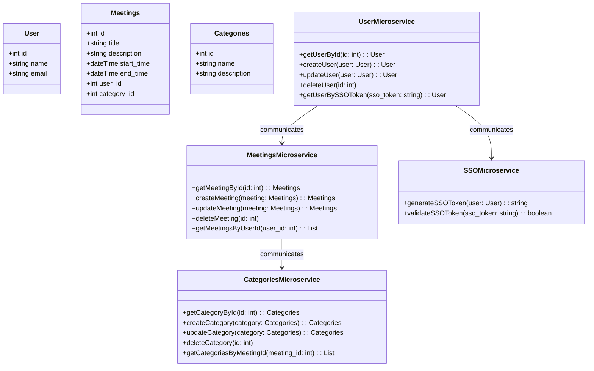

# Meetup App

## Requirements
### Functional Requirements
- **User Registration and Login**: Users should be able to create an account and log in to the app with their email and password, or by using social media accounts.
- **Category Management**: Users should be able to browse and join categories of their interest (such as sports, technology, music, etc.) and create new categories if they don't exist.
- **Meeting Creation**: Users should be able to create a meeting within a category by specifying the date, time, location, and other relevant details.
- **Meeting Management**: Users should be able to manage their meetings, which include editing or canceling meetings, as well as seeing other user's meetings that they've joined.
- **Meeting Search and Filtering**: Users should be able to search and filter meetings based on different criteria like location, date, category, etc.

### Non-Functional Requirements
- **Scalability**: The system should be able to handle a large number of users and meetings without any performance issues.
- **Security**: The app should have proper security measures in place to protect user data and prevent unauthorized access to the system.
- **Availability**: The app should be available 24/7 with minimal downtime for maintenance or upgrades.
- **Performance**: The app should be responsive and performant, with fast loading times for pages and quick search results.

### Estimations:
- 100,000 users
- 50 categories
- 100 meetings per day (on average)

Daily Active User (DAU) rate of 30% = 30,000 users accessing endpoints
Assuming each user browses an average of 2 categories per day, we can estimate the number of category-related requests per day to be:

**Category browsing**: 30.000 users * 2 = 60.000 Category browsing per day

each meeting generates an average of 10 views, we can estimate the number of meeting-related requests per day to be:

**Meeting creation**: 100 per day

**Meeting views**: 1000 per day

Assuming each user profile takes up an average of 1 MB of data, we can estimate the total amount of user data to be:
- User data: 100,000 MB (100 GB)
Assuming each meeting takes up an average of 10 KB of data, we can estimate the total amount of meeting data to be:
- Meeting data: 10,000 KB (10 MB)


## Development



## Tools
- minikube
- kubectl
- kubeseal

## How to run
1. create a `infrastructure/modules/argocd/overlays/repository-secret.yaml` file using `repository-secret.example.yaml` as template and fill out the proper values

2.
```sh
make up
```

*forward ports*
```sh
kubectl port-forward svc/argocd-server -n argocd 8080:443
kubectl port-forward svc/meetings-svc -n meetings 4000:4000
kubectl port-forward svc/categories-svc -n categories 4000:4000
```

*test kafka connection*
```sh
## test kafka connection
kubectl -n kafka run kafka-producer -ti --image=quay.io/strimzi/kafka:0.32.0-kafka-3.3.1 --rm=true --restart=Never -- bin/kafka-console-producer.sh --bootstrap-server my-cluster-kafka-bootstrap.kafka.svc.cluster.local:9092 --topic my-topic # producer

kubectl -n kafka run kafka-consumer -ti --image=quay.io/strimzi/kafka:0.32.0-kafka-3.3.1 --rm=true --restart=Never -- bin/kafka-console-consumer.sh --bootstrap-server my-cluster-kafka-bootstrap.kafka.svc.cluster.local:9092 --topic my-topic --from-beginning # consumer
```

### Build Images
```sh
# Categories
export CATEGORY_VERSION='1.0.8'
docker build -t gbrotas/meetup-categories:$CATEGORY_VERSION \
    -t gbrotas/meetup-categories:latest \
    -f microservices/categories/Dockerfile.prod microservices/categories

docker push gbrotas/meetup-categories --all-tags

# Meetings
export MEETINGS_VERSION='1.0.8'

docker build -t gbrotas/meetup-meetings:$MEETINGS_VERSION \
    -t gbrotas/meetup-meetings:latest \
    -f microservices/meetings/Dockerfile.prod microservices/meetings

docker push gbrotas/meetup-meetings --all-tags
```

### clean up
```sh
make down
```